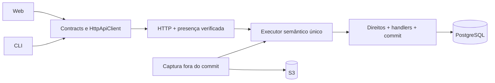

# Arquitetura consolidada

## Forma inicial

Começar com um monólito modular de ontologia, servidor e dois clientes. Cinco workspaces bastam para a primeira jornada. São fronteiras de código; separação de pacote não equivale a isolamento de processo ou credencial.

```text
apps/
  server/src/
    main.ts
    composition.ts
    http/                 # transporte e contexto verificado
    identity/             # presença, sessão e logout
    adapters/             # implementações específicas de PG/S3
  web/src/                # apresentação sobre HttpApiClient
  cli/src/                # comandos sobre HttpApiClient
packages/
  contracts/src/          # Effect Schema, HttpApi, operações e DTOs públicos
  ontology/src/
    commit/               # única fronteira de mutação e idempotência
    access/               # direitos e membership/disclosure
    evidence/             # captura, import, open e cleanup
    knowledge/            # claims, interpretação, correções e subject identity
    erasure/              # política World-wide de suppression/purge
    semantic/             # executor e composição explícita por família
ops/
  compose.yaml            # PostgreSQL e S3 compatível reais
  migrations/             # sequência global, somente integrador
tests/
  integration/            # componentes reais e fronteiras
  acceptance/             # navegador e equivalência CLI
  security/               # testemunhas independentes
```

Árvore de destino, não instrução para criar todas as pastas antecipadamente. Leis puras e testes de módulo ficam junto do código. Diretórios transversais guardam provas que cruzam fronteiras. Não estabelecer teto de arquivos que force módulos gigantes; cada arquivo deve ter responsabilidade e uso demonstráveis.



O diagrama representa chamadas, não imports de cliente para backend. `contracts` não importa `ontology`, servidor, SQL ou configuração de autenticação. Web/CLI importam contratos e usam `HttpApiClient`; não precisam de um pacote `client` que apenas embrulhe esse cliente. `ontology` nunca importa `apps/server`; a composição fornece serviços e drivers. Nenhum handler HTTP acessa um adapter para contornar o executor.

## Effect como base

| Responsabilidade | Usar | Semântica que Zoen ainda precisa implementar |
| --- | --- | --- |
| Fronteiras e erros | Schema, Schema.Class, Schema.TaggedError | Operações estritas, valores canônicos, erros públicos seguros |
| Dependências e recursos | Context.Service, Layer, Scope, acquireRelease | Credenciais mínimas e composições explícitas |
| Trabalho assíncrono | Effect.fn, Effect.gen, Schedule, Stream | Cancelamento, orçamento e revogação por emissão |
| Servidor e clientes | HttpApi, HttpApiBuilder, HttpApiClient, middleware | Contexto confiável, único executor e disclosure final |
| Persistência | Driver PostgreSQL do Effect, SqlClient.withTransaction, migrator | SERIALIZABLE, read set, guardas, receipts, outbox e fencing |
| CLI | effect/unstable/cli | Mesmas operações/resultados da web |
| Telemetria | Logs, spans, métricas e OTLP do Effect | Atributos permitidos e ausência de conteúdo privado |
| Testes | @effect/vitest e funções puras diretas | Testemunhas reais de atomicidade, sigilo e recuperação |

Fixar uma combinação coerente de Effect 4, drivers e ferramentas no bootstrap; consultar as APIs instaladas e executar a compatibilidade. A referência anterior usa RC, não constitui aprovação automática dessa versão. TypeScript 7 será o único compilador. O [README oficial do Effect](https://github.com/Effect-TS/effect) documenta a linha v4 e recomenda TS7.

Não reconstruir DI, fibers, retry, parser CLI, framework HTTP ou runtime de testes. Hono não é necessário para um invólucro da API Effect. `ManagedRuntime` fica restrito a uma borda imperativa que realmente o exija. Não criar uma abstração genérica duplicando SQL/UnitOfWork. `Queue` e `PubSub` não substituem persistência durável.

## Contratos mínimos e autoridade

1. **API pública:** operações liberadas, schemas estritos, IDs, `operationId`, resultados tipados, referências de evidência e projeção visível. O cliente não fornece papel SQL, membership, grants, purpose privilegiado ou outro contexto confiável no JSON.
2. **Presença:** adaptador de autenticação real produz prova verificada. Presença não concede acesso a World. Membership e autorização continuam no executor. Se a biblioteca de identidade usar SQL, recebe papel/conexão sem poder sobre a autoridade.
3. **Commit:** uma fronteira por World valida intenção canônica, contexto atual, guardas/read set e idempotência; mudanças, receipt e outbox persistem atomicamente. Isolamento SERIALIZABLE precisa de configuração e testes explícitos. Retry é limitado e não renova consentimento ou muda silenciosamente a base da decisão.
4. **Leitura e emissão:** autorização se aplica antes da leitura e novamente na emissão, replay, stream e download. Referência, cursor, app session e continuation link não são grants.
5. **I/O externo:** staging, requisição e observação de provider ocorrem fora do commit. Persistir intenção antes de enviar. Timeout depois do envio pode resultar em Unknown; não significa falha sem efeito, sucesso ou liberação automática de reserva.

`ExecutionBasis` interno registra dependências e cortes necessários à decisão. `VisibleFrame` contém somente conteúdo e metadados permitidos. Um hash opaco global que muda com dados escondidos ainda vaza informação; não é solução de não interferência. Testar também revisões, paginação, contagens, ordenação, erros e cursores.

O primeiro fluxo de correção tem Case e Question mínimos, escopo e identidade histórica. D11 expande a governança de ações liberadas; não será introduzido um segundo mecanismo para substituir uma correção provisória privilegiada.

## Persistência e composição

PostgreSQL é a autoridade; S3 guarda payloads retidos, com referência transacional e publicação controlada. Nenhuma autoridade, política de domínio ou reconciliação paralela para app ou conectores. Estado de transporte e leases são persistência operacional legítima com dono/credencial delimitados. Captura tem estados explícitos de staging/publicação/falha; não fingir atomicidade entre S3 e SQL. Pins, limpeza de órfãos e supressão de apagamento pertencem ao ciclo de vida desde que a operação correspondente for habilitada.

Genesis, escopo de idempotência sem transporte, três tentativas totais de transação e as 24 leis preservadas estão definidos em [invariants.md](invariants.md). Esse contrato impede criar uma transação privilegiada de bootstrap ou retry genérico que repita um efeito externo.

Cada worker possui seus módulos e testes e pode propor DDL nesse escopo. O integrador revisa contratos cruzados, atribui a próxima migração e executa a composição. Não renumerar migrações aplicadas. O integrador não reserva o schema inteiro durante o desenvolvimento dos consumidores.

Famílias de operação exportam Layers e schemas por módulo. Um ponto de composição pequeno importa essas famílias explicitamente. Sem arquivo central contendo todo o produto, sem plugin registry dinâmico para evitar imports. Cada novo módulo precisa de caminho exercido até sua superfície real.

## Crescimento condicionado ao uso

Jobs de provider e compute ganham processos separados quando entram no produto, com credenciais mínimas próprias; não herdam todo o ambiente do servidor. MCP/agente (futuro) adapta Worlds — não reinstala chat Eve. Separar pacotes `client`, `identity` ou `connectors` somente quando houver consumidores e necessidade concretos. Governança, dados densos, enterprise e federação ampliam a autoridade existente em módulos; não viram 56 microserviços.

Docker será a base local e de CI; Fly é o destino de hospedagem planejado. PostgreSQL e um store S3 compatível serão executados e verificados no bootstrap. Nome de imagem, versão ou perfil não é prova de compatibilidade, licença ou backup. Hospedagem exige a topologia e recuperação reais de D04.

**Turborepo fica fora do bootstrap.** pnpm workspaces e comandos diretos bastam inicialmente. Reavaliar quando o grafo de builds e medições frias/quentes mostrarem benefício. Se adotado, declarar inputs/outputs e dependências; integrações e admissões continuam sem cache de resultado. O [contrato oficial de configuração do Turbo](https://github.com/vercel/turborepo/blob/main/apps/docs/content/docs/reference/configuration.mdx) será referência nessa decisão.

## Fronteira selecionada (ZA-26)

O diagrama de destino acima é **intenção**, não prova de operação. Em `aa7bc31` (#113 ZA-25) a fronteira selecionada reconcilia escopos **implementados / qualificados / bloqueados** em [`docs/verification/frontier-integration.md`](verification/frontier-integration.md) e [`docs/verification/frontier-status.json`](verification/frontier-status.json).

- ICPs nomeados (household, bakery, clinic admin, finance) têm jornadas web/CLI reais; isso **não** ativa D03/D04/D05 integrais.
- Produto tip = Worlds only; Eve/OpenCode/voice product surface removed (`fullD05` / `textProfileAccepted` stay false).
- Hosted Erased, controlador independente (H-01), `G-STORAGE-FENCE` e `restoreAfterErasure` permanecem Blocked/Unknown/false.
- Nunca rotular o diagrama inteiro como implementado.
