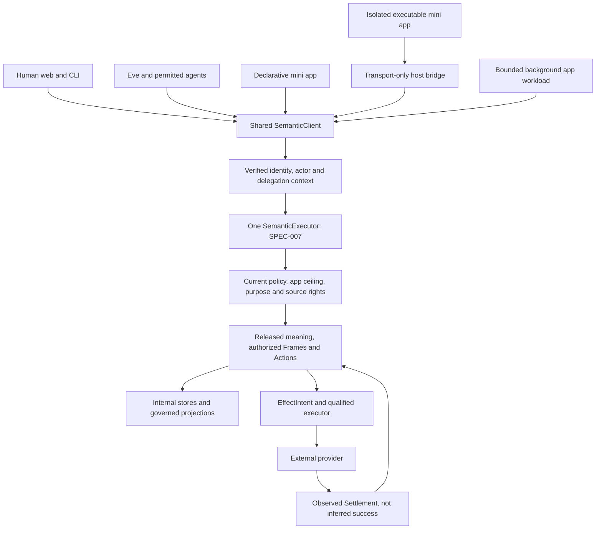
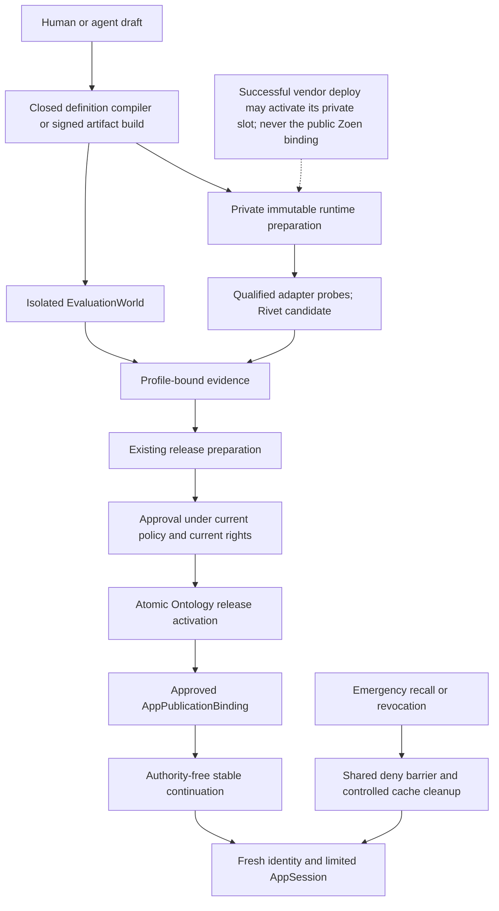

# Mini-app architecture diagrams — v4

Editable Mermaid views of the normative contracts. They do not claim a deployed product or independently authorize any path. The ticket dependency graph, not the phase illustration, determines executable work.

## One operational world, multiple clients

[Editable source](diagrams/one-semantic-path.mmd)



## Protected opening and current authorization

[Editable source](diagrams/protected-app-opening.mmd)

```mermaid
sequenceDiagram
    participant User as Recipient browser
    participant Host as Trusted Zoen host
    participant Door as Door identity
    participant Ont as Ontology executor
    participant App as Isolated guest if admitted
    User->>Host: GET opaque continuation reference
    Host-->>User: Generic non-consuming shell; no private metadata
    User->>Host: Explicit browser-bound POST
    Host->>Door: Existing session or identity challenge
    Door-->>Host: Verified identity and assurance
    Host->>Ont: Open context using current rights and approved binding
    Ont-->>Host: Authorized scope or neutral denial
    Host-->>User: Trusted renderer or admitted guest bootstrap
    opt Explicitly qualified executable disclosure profile
        Host->>App: Verified artifact bytes through bound MessageChannel
        App->>Host: Schema-valid semantic call; no caller-supplied authority
        Host->>Ont: Same executor with verified current context
        Ont-->>Host: Authorized result or typed denial
        Host-->>App: Allowed result within approved disclosure profile
    end
    Note over Host,Ont: Recheck every call, export chunk and subscription delivery
```

## Runtime readiness is not publication

[Editable source](diagrams/runtime-publication.mmd)



## Progressive delivery without alternate implementations

[Editable source](diagrams/mini-app-phases.mmd)

```mermaid
flowchart LR
    S0[S0: shared executor and no-bypass graph] --> S1[S1: protected Focus continuation]
    S1 --> S2[S2: private declarative apps]
    S2 --> S3[S3: sharing and scoped read parity]
    S3 --> S4[S4: governed forms and action parity]
    S4 --> S5[S5: rich views and generated clients]
    S5 --> S6[S6: isolated host, MCP and Rivet qualification]
    S6 --> S7[S7: dense, live and measured app workloads]
    S7 --> S8[S8: full Studio and three-audience capstone]
    S8 --> End[S9-S11: enterprise, federation and finance]
```



See [shared semantic path](semantic-path.md), [protected links](protected-links.md), [host security](app-host-security.md) and [Rivet adapter](rivet-adapter.md) for the authoritative details.
